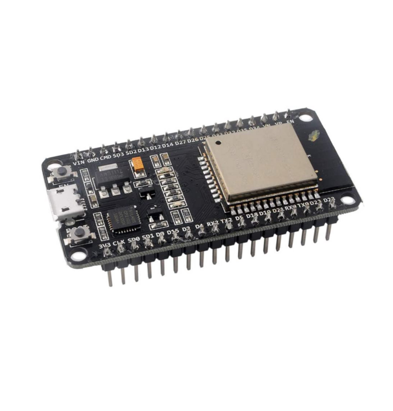
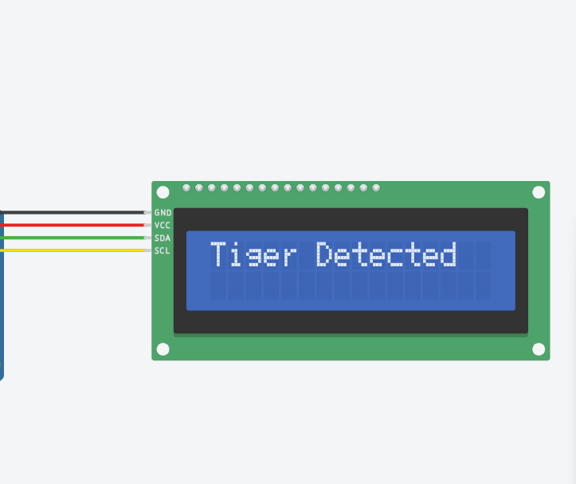
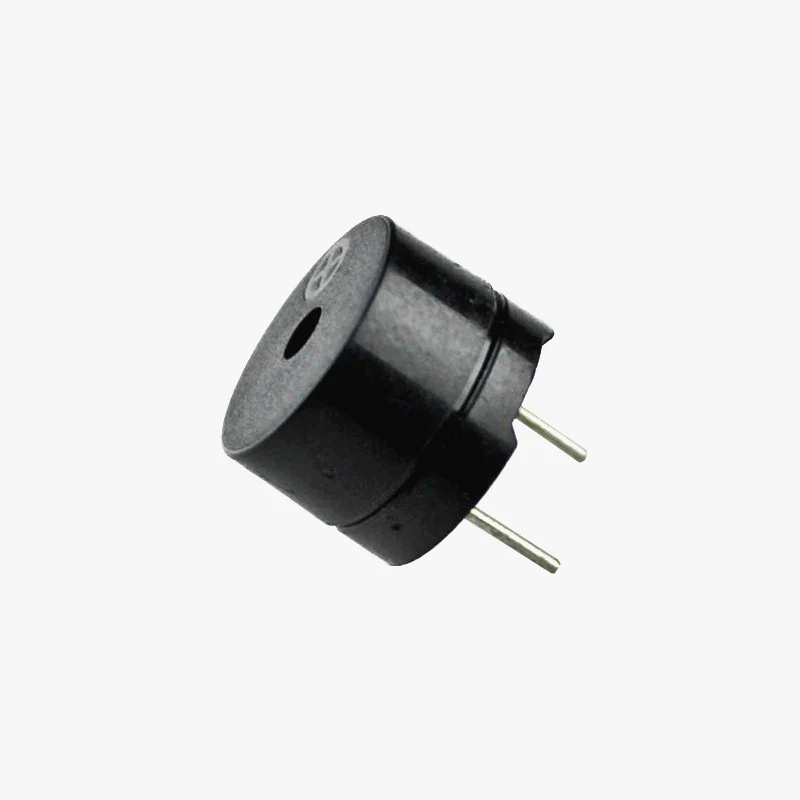

# Wild Watch: Early Animal Detection for Ultimate Protection

Wild watch aims to boost safety along Nepal's wildlife habitats bordering human settlements using object detection technique. It spots dangerous animals and alerts authorities or nearby communities for swift action, focusing on areas near national parks, wildlife reserves, and forests.

It uses a custom-trained YOLOv8 model. This model is deployed on a Flask server for processing of live feed, which is then recieved by a react app and an alert system. Alert system seamlessly integrates IoT components like LCD displays and buzzers, enabling timely alerts for proactive measures.

# Prerequisites

- You must have `Python 3` installed on your system.
- You must have `Git` installed on your system.
- **(Optional)** You should have `Node.js` (npm) installed on your system (if using development server)


# Server

To run the server, execute the following command:

```
python server.py
```

Certain parameters in the `config.json` file can be changed to customize the system's behavior:
```json
{
    "yolo_model_path": "best.pt",
    "url": 0,
    "scale_factor": 0.5,
    "confidence_threshold": 0.65,
    "esp32_api": "http://192.168.23.188/api/animal-detected"
}
```

- `yolo_model_path`: This parameter denotes the file path to a YOLOv8 model; crucial for identifying animals during video streams.

- `url`: Denotes the URL of video feed or physical camera index related to camera input. For example: "0" suggests it represents the index of the camera source.

- `scale_factor`: Determines the scaling factor applied to input images before processing by the detection model.Input images are resized to half of their original dimensions, impacting processing speed and detection accuracy.

- `confidence_threshold`: Sets the minimum confidence level required for object detection predictions to be considered valid. A threshold means predictions must have a confidence score of threshold or higher to be accepted.

- `esp32_api`: Specifies the endpoint of an API hosted on an ESP32 device. This API is further used for an alarm system, facilitating communication between the detection system and downstream processes for further proactive measures.

# Frontend

To run the frontend, follow these steps:

1. Ensure that the server is running. If not, follow the instructions in the previous section to start the server.

2. Navigate to the frontend directory in your terminal:
   ```
   cd path_to_your_front_end_directory
   ```
3. Install dependencies by running:
   ```
   npm install
   ```
4. Once the dependencies are installed, start the frontend application with:
   ```
   npm start
   ```
5. Open your web browser and visit [http://localhost:3000](http://localhost:3000) to view the frontend interface.
6. You can now see the video feed and output sections to observe animal detection results.
7. Additionally the team member details are provided

## VideoStream Component

The `VideoStream` component is responsible for displaying the video feed and output data from the backend server. It communicates with the server to fetch the video feed and real-time output data using HTTP requests.

### How It Works

1. **Video Feed**: The component requests the video feed from the backend server using an HTTP GET request to `http://localhost:5000/video_feed`. The video feed is then displayed using an `` tag with the appropriate source URL.

2. **Output Data**: The component fetches real-time output data from the backend server using an asynchronous `fetch` request to `http://localhost:5000/output_data`. This data contains information about detected animals. The component periodically fetches new data every 5 seconds.

## Ports and Endpoints

Ensure that the backend server is running on port 5000 for the component to fetch the video feed and output data. The following ports and endpoints are used:

- **Video Feed**: `http://localhost:5000/video_feed`
- **Output Data**: `http://localhost:5000/output_data`

## Usage

To integrate the `VideoStream` component into your frontend application, simply import it and include it in your component hierarchy. You can customize the appearance and behavior of the component as needed.

```jsx
import React from "react";
import VideoStream from "./components/VideoStream";

const App = () => {
  return (
    <div className="App">
      <VideoStream />
    </div>
  );
};

export default App;
```


# Contributors

| Name              | Contribution          | Linkedin Profile                              |
|:-----------------:|:---------------------:|:---------------------------------------------:|
| **Abhash Rai**    | Team Lead & Backend | [Abhash Rai](https://www.linkedin.com/in/abhash-rai/) |
| **Nabin Oli**     | Machine Learning      | [Nabin Oli](https://www.linkedin.com/in/nabinoli/) |
| **Bishesh Giri**  | Frontend              | [Bishesh Giri](https://www.linkedin.com/in/bisheshgiri/) |
| **Sudeep Fullel** | IOT                   | [Sudeep Fullel](https://www.linkedin.com/in/sudeepfullel/) |
| **Sanket Shrestha** | Documentation       | [Sanket Shrestha](https://www.linkedin.com/in/sanketstha/) |
| **Shankar Tamang**  | Documentation       | [Shankar Tamang](https://www.linkedin.com/in/shankartamang/) |

<br>

# IoT Alarm System

Wildwatch's IoT Alarm System component integrates various hardware devices to provide timely alerts based on animal detection. This documentation details the setup and functionality of the IoT components, including the LCD display and buzzer, specifically for the ESP32 platform.

## Overview

Wildwatch's IoT Alarm System, implemented on the ESP32 platform, is designed to enhance wildlife monitoring efforts by providing real-time alerts when animals are detected. The system utilizes two main hardware components: an LCD display for visual alerts and a buzzer for audible alerts. These components are integrated into the system to ensure timely notifications to users.

## Hardware Components

1. **ESP32 Microcontroller**: The ESP32 microcontroller serves as the central processing unit for the IoT Alarm System. It manages the communication with other hardware components, such as the LCD display and buzzer, and handles the logic for animal detection and alert generation.

   
   _Esp32 Diagram_

2. **LCD Display (16x2)**: The 16x2 I2C LCD display is used to provide visual alerts to users. It displays messages such as "No Animal Detected," "Single Animal Detected," or "Multiple Animals Detected" based on the detection results. The display ensures that users can quickly and easily understand the current status of animal activity.

   
   _LCD Display Wiring Diagram_

3. **Buzzer**: The buzzer is employed to provide audible alerts when animals are detected. It emits a sound to alert users of potential wildlife activity, ensuring that alerts are not missed even in noisy environments or when users are not directly monitoring the system.

   
   _Buzzer Diagram_

## Hardware Setup

1. **ESP32 Setup**:

   - Connect the ESP32 microcontroller to the necessary power source and ensure it is programmed with the appropriate firmware to control the LCD display and buzzer.

2. **LCD Display Wiring**:

   - Connect the 16x2 LCD display to the ESP32 microcontroller using the following wiring:
     - VCC to 5V
     - GND to GND
     - SDA to GPIO pin (e.g., GPIO21)
     - SCL to GPIO pin (e.g., GPIO22)

3. **Buzzer Wiring**:
   - Connect the buzzer to the ESP32 microcontroller using the following wiring:
     - Positive (+) terminal to GPIO pin (e.g., GPIO13)
     - Negative (-) terminal to GND

## Functionality

1. **ESP32 Logic**:

   - The ESP32 microcontroller receives input from sensors or image processing modules to detect animals.
   - It processes the detection results and triggers the appropriate actions on the LCD display and buzzer based on the detection outcome.

2. **LCD Display Operation**:

   - Upon detecting animals, the ESP32 sends signals to the LCD display to update the displayed message.
   - If no animals are detected, the display shows "No Animal Detected."
   - If a single animal is detected, the display shows the name of the animal followed by "Detected."
   - If multiple animals are detected, the display shows "Multiple Animals Detected."

3. **Buzzer Activation**:
   - When animals are detected, the ESP32 activates the buzzer to emit a sound alert.
   - The buzzer continues to sound for a predefined duration to ensure that users are alerted to the presence of animals.

## Code Snippets

### Python(Function) Script for server (test_iot_server.py)

```python
import requests
import json

def send_animal_data(animal_names_list):
    url = "http://192.168.23.188/api/animal-detected"
    data = {"animal_names": animal_names_list}
    headers = {"Content-Type": "application/json"}

    try:
        response = requests.post(url, json=data, headers=headers)
        response.raise_for_status()
        print("Data sent successfully")
    except requests.exceptions.RequestException as e:
        print("Error sending data:", e)

# Example usage:
animal_names_list = ["Abhash"]
send_animal_data(animal_names_list)

```

### Esp32Script for server (Esp32_server.py)

```C++
#include <WiFi.h>
#include <WebServer.h>
#include <Wire.h>
#include <ArduinoJson.h>
#include <LiquidCrystal_I2C.h>

const char *ssid = "Sunway_304";
const char *password = "sunway@123";

WebServer server(80);

const int buzzerPin = 13;
const unsigned long buzzerDuration = 5000;
const unsigned long displayResetDuration = 7000;
unsigned long lastBuzzerTime = 0;
unsigned long lastDisplayUpdateTime = 0;

LiquidCrystal_I2C lcd(0x27, 16, 2);

void handleAnimalDetection()
{
    if (server.method() == HTTP_POST)
    {
        String receivedData = server.arg("plain");
        Serial.print("Received data: ");
        Serial.println(receivedData);

        StaticJsonDocument<200> doc;
        DeserializationError error = deserializeJson(doc, receivedData);

        if (error)
        {
            Serial.print("JSON parsing error: ");
            Serial.println(error.c_str());
            return;
        }

        JsonArray animalNames = doc["animal_names"];

        if (animalNames.size() == 0)
        {
            digitalWrite(buzzerPin, LOW);
            lcd.clear();
            lcd.setCursor(0, 0);
            lcd.print("No Animal Detected");
        }
        else if (animalNames.size() == 1)
        {
            digitalWrite(buzzerPin, HIGH);
            lcd.clear();
            lcd.setCursor(0, 0);
            lcd.print(animalNames[0].as<String>() + " Detected");
            lastBuzzerTime = millis();
        }
        else
        {
            digitalWrite(buzzerPin, HIGH);
            lcd.clear();
            lcd.setCursor(0, 0);
            lcd.print("Multiple Animals Detected");
            lastBuzzerTime = millis();
        }

        lastDisplayUpdateTime = millis();

        server.sendHeader("Access-Control-Allow-Origin", "*");
        server.sendHeader("Access-Control-Allow-Methods", "GET, POST, PUT, DELETE");
        server.sendHeader("Access-Control-Allow-Headers", "Content-Type, Authorization");

        server.send(200, "text/plain", "Data received successfully");
    }
    else
    {
        server.send(405, "text/plain", "Method Not Allowed");
    }
}

void handleOptions()
{
    server.sendHeader("Access-Control-Allow-Origin", "*");
    server.sendHeader("Access-Control-Allow-Methods", "GET, POST, PUT, DELETE");
    server.sendHeader("Access-Control-Allow-Headers", "Content-Type, Authorization");
    server.send(200);
}

void setup()
{
    Serial.begin(115200);
    pinMode(buzzerPin, OUTPUT);
    lcd.init();
    lcd.backlight();

    WiFi.begin(ssid, password);
    while (WiFi.status() != WL_CONNECTED)
    {
        delay(1000);
        Serial.println("Connecting to WiFi...");
    }
    Serial.println("Connected to WiFi");
    Serial.print("IP Address: ");
    Serial.println(WiFi.localIP());

    server.on("/api/animal-detected", HTTP_POST, handleAnimalDetection);
    server.on("/api/animal-detected", HTTP_OPTIONS, handleOptions);

    server.begin();
    Serial.println("HTTP server started");
}

void loop()
{
    server.handleClient();

    if (millis() - lastBuzzerTime >= buzzerDuration)
    {
        digitalWrite(buzzerPin, LOW);
    }

    if (millis() - lastDisplayUpdateTime >= displayResetDuration)
    {
        lcd.clear();
        lcd.setCursor(0, 0);
        lcd.print("Alert System");
        lastDisplayUpdateTime = millis();
    }
}


```
